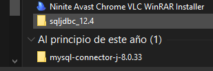
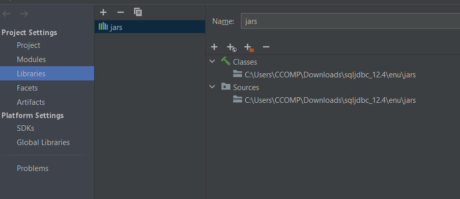
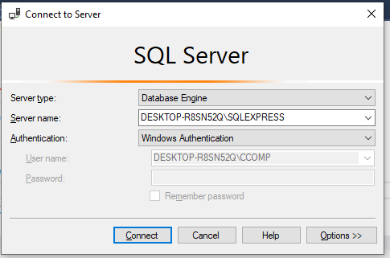
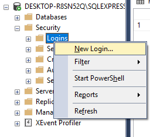
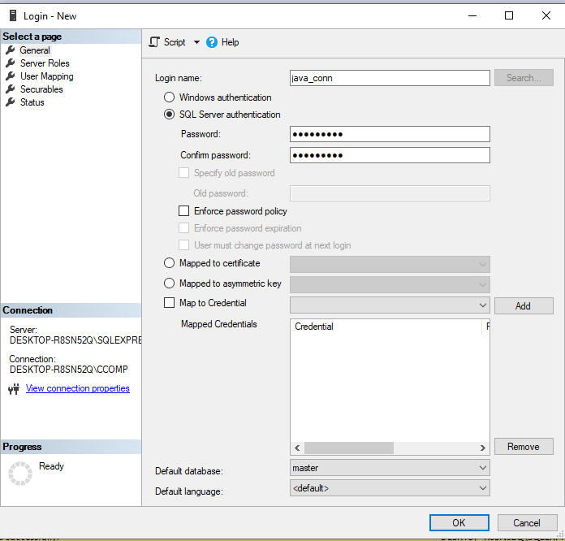
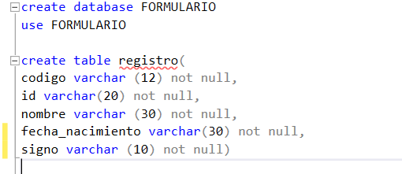
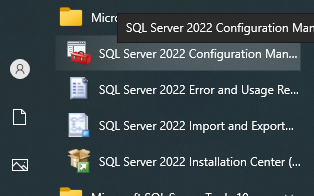
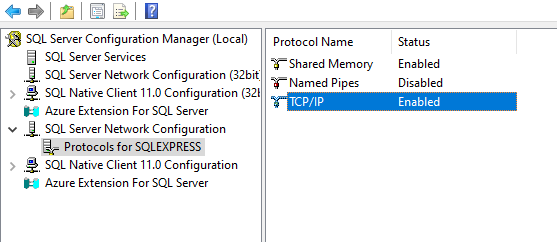
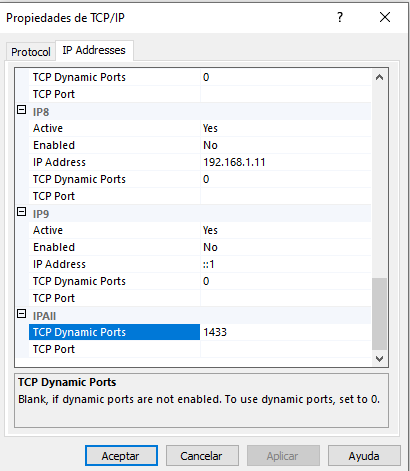
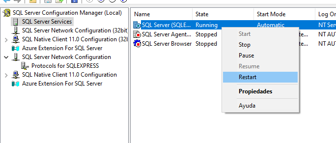

# Correccion_Conexion_SQLServer

Para el presente ejercicio debemos tener en cuenta algunos pasos antes de desarrollar la conexión con SQL Server 
mediante Java en Intellij Idea. Como primer punto vamos a descargar el driver de conexion de la base de datos con Java, 
esta se la puede encontrar en Microsoft. Es uno de los metodos para realizar una conexión, una vez descargado el 
archivo el cual será de tipo .zip, se procede a descomprimir. 

Abrimos el Intellij Idea, en donde creamos nuestro proyecto. Una vez creado crearemos las clases del form y la clase 
donde estará el menu principal. Para realizar la conexión con SQL Server, añadiremos el driver en File/Proyect Structure/
Libraries, ahí agregaremos la carpeta donde este ubicado los archivos jar de nuestra carpeta descomprimida previamente.

Realizamos el diseño de nuestra aplicación y luego nos dirigimos a SQL Server Management, allí crearemos un nuevo login, 
esto ya que necesitamos un usuario y contraseña para establecer nuestra conexión. Una vez creado y dados los permisos 
correspondientes desde nuestro Windows Authentication hacia nuestro nuevo usuario mediante los siguientes pasos:

inicio de seccion en windows authentication

Creacion de nuevo usuario

Una vez creado nuestro usuario, debemso realizar una modificacion para que se llegue a conectar, para ello nos dirigimos
a SQL Server 2022 Configuration Manager (Esta es la version utilizada por mi en este momento), en donde realizaremos 
los siguientes pasos para configurar el puerto de conexion de SQL con Java, en los puertos TCP/IP.

Si el TCP/IP se encuentra desactivado, hay que activarlo, y antes de cerrar nos dirigimos a la pestaña IP Address, y 
escribimos el puesto "1433". luego nos dirigimos a SQL Server services, damos click derecho sobre SQL Server(SQLEXPRESS)
y aplastamos en reiniciar para agregar los cambios, finalmente aplicamos y aceptamos. 

